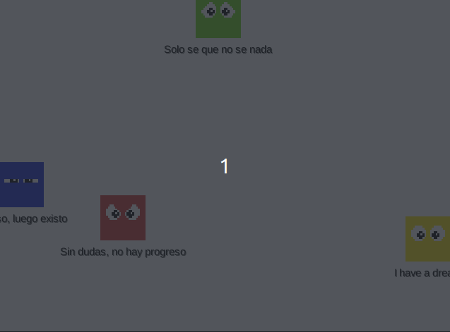

# Actividad 1: Atlas packer
Define una tarea Gradle (y las subtareas necesarias) para
(1) descomprimir el fichero `piskel.zip`, (2) ensamblar las imágenes 
extraídas en una sola imagen atlas ubicada en `assets/atlas.png` y por 
último (3) borrar tanto el fichero ZIP como las imágenes extraídas.

* (1) Para descomprimir un fichero ZIP con una tarea gradle puedes consultar:
https://docs.gradle.org/current/userguide/working_with_files.html#sec:unpacking_archives_example


* (3) Para eliminar ficheros puedes consultar:
https://docs.gradle.org/current/userguide/working_with_files.html#sec:deleting_files_example


* (2) Para ensamblar varias imágenes PNG en una sola imagen resultante puedes usar el siguiente código Groovy:
    ```groovy
    import javax.imageio.ImageIO
    import java.awt.Graphics
    import java.awt.image.BufferedImage
    
    
    BufferedImage result = new BufferedImage(64, 64*4, BufferedImage.TYPE_INT_RGB)
    Graphics g = result.getGraphics()
    
    int y = -64
    file("somedirectory").listFiles({file -> file.name.endsWith(".png")} as FileFilter).each {file ->
        g.drawImage(ImageIO.read(file), 0, y+=64, 64, 64, null)
    }
    ImageIO.write(result,"png",new File("atlas.png"))
    ```
    *** Este código busca las imágenes con extensión `.png` que haya dentro de un directorio llamado 
`somedirectory`, y ensambla las cuatro primeras una debajo de otra, a tamaño 64x64, en una imagen resultante
llamada `atlas.png`.

# Actividad 2: Class generator

Define una tarea Gradle que **lea** las líneas del fichero de un fichero de texto, 
y luego, **genere** un fichero ".java" en el que debe haber definida una clase con un campo
estático de tipo array de strings; los elementos de este array serán cada una de las
lineas que se han leído.

Por ejemplo, si el fichero de texto contiene estas líneas:
```
Solo se que no se nada
I have a dream
Pienso, luego existo
Sin dudas, no hay progreso
```

La tarea debe generar un fichero ".java" similar al siguiente:
```java
class NombreDeLaClase {
  static String[] nombreDelArray = {
    "Solo se que no se nada",
    "I have a dream",
    "Pienso, luego existo",
    "Sin dudas, no hay progreso"
  };
}
```
*** Tanto la ubicación de este fichero java, como los nombres de la clase y del array, tendrás 
que averiguarlos a partir del codigo del fichero `core/src/com/mygdx/game/MyGdxGame.java`.

### TIPS:
* Para leer todas las líneas del fichero y obtenerlas en un `List<String>` puedes utilizar:

```java
import java.nio.file.Paths;
import java.nio.file.Files;

Files.readAllLines(Paths.get("ElFicheroDeLectura"))
```

* Para escribir un `String` en un fichero puedes utilizar:

```java
import java.nio.file.Paths;
import java.nio.file.Files;


Files.writeString(Paths.get("ElFicheroDeEscritura"), elStringAEscribir)
```
